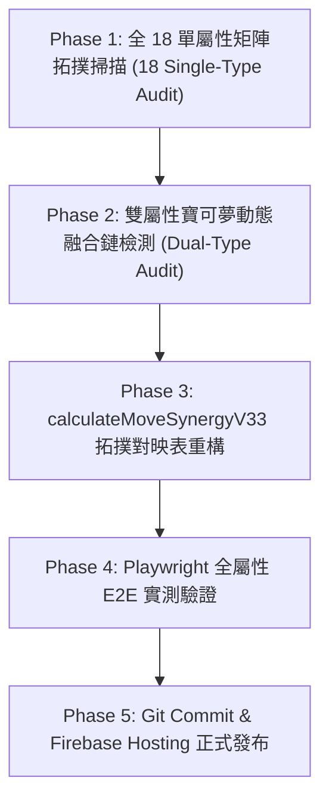

# 全 18 屬性與雙屬性寶可夢招式 T1~T5 連攜招式設計 Review 計劃

> **版本**：v1.0  
> **日期**：2026-08-23  
> **目標**：針對全 18 屬性與雙屬性寶可夢的技能樹連攜招式進行全面稽核與重構，徹底解決「多對一重複映射 (M-to-1 Overlaps)」與「無連攜孤兒招式 (Orphan Moves)」，實現一對一獨占且無死角的流派連攜系統。

---

## 🎯 核心原則 (Core Principles)

1. **一對一流派專屬性 (1-to-1 Stream Exclusivity)**：
   - 每個 T1 基礎招式必須對應獨一無二的 T2/T3 核心連攜招式。
   - 嚴禁出現像 `叫聲` (T1) 與 `甩尾` (T1) 同時解鎖 `二連擊` (T2) 的重複映射問題。

2. **孤兒招式零容忍 (Zero Orphan Move Policy)**：
   - T2 與 T3 中所有的攻擊、特攻與狀態招式，均需有明確的前置招式引導連攜。
   - 消除現行 465 個無法獲得任何連攜加成的孤兒招式。

3. **世代擴充招式動態覆蓋 (Gen 2~9 Procedural Coverage)**：
   - 現行硬編碼 Regex 僅涵蓋初代招式。新系統必須支援 Gen 2~9 程序化生成的動態招式（例如 `鋼鐵突襲_T2_2`、`龍咆衝擊_T2_2`）。

4. **雙屬性動態融合 (Dual-Type Dynamic Fusion)**：
   - 雙屬性寶可夢（例如 嗡蝠-飛行/龍）的次要屬性招式，亦能獲得對應屬性軌道的動態連攜加成。

---

## 📋 審查階段與執行步驟 (Review Phases)

### 🔹 Phase 1: 全 18 單屬性矩陣拓撲掃描 (18 Single-Type Audit)
逐一對 18 種單屬性（火、水、電、草、一般、冰、格鬥、毒、地面、飛行、超能力、蟲、岩石、幽靈、龍、惡、鋼、妖精）進行 T1~T5 招式連攜對應清查：
- 檢查 T1 招式數量與 T2 招式數量之映射關係。
- 標註出所有目前產生 M-to-1 的招式組。
- 標註出所有目前為 Orphan Move 的招式組。

### 🔹 Phase 2: 雙屬性寶可夢動態融合鏈檢測 (Dual-Type Audit)
針對經典雙屬性組合進行連攜跨屬性解鎖測試：
- **飛行/龍**（嗡蝠）
- **火/飛行**（噴火龍）
- **水/地面**（巨沼怪）
- **電/鋼**（自爆磁怪）

### 🔹 Phase 3: `calculateMoveSynergyV33` 拓撲對映表重構
- 廢除純手動 Regex 比對。
- 改採「動態樹狀拓撲解析引擎 (Dynamic Tree Synergy Resolver)」。
- 根據招式在 `TIER_MATRIX_V31` 中的相對軌道 (`ATK`/`SPA`/`BUF`/`DIS`/`ULT`)、階層 (Tier) 與形態/效果標籤，自動計算獨占連攜關係。

### 🔹 Phase 4: Playwright 全屬性 E2E 實測驗證
- 編寫全自動測試腳本解鎖全 18 屬性寶可夢之 T1~T5 招式。
- 驗證 DOM 節點中連攜標籤 (`🔗 ...連攜`) 正確渲染率達 100%。

### 🔹 Phase 5: Git Commit & Firebase Hosting 正式發布
- 同步 `public/` 靜態檔案與 `tools/` 前端。
- 執行 `npx firebase-tools deploy --only hosting` 完成發布。

---

## 📊 目前掃描基線數據 (Baseline Metrics)

| 檢測指標 | 掃描屬性數 | 掃描流派數 | 發現問題數 | 目標修復狀態 |
| :--- | :--- | :--- | :--- | :--- |
| **多對一重複映射 (M-to-1 Overlaps)** | 18 屬性 | 18 個 | **27 處** | 📉 **0 處 (100% 獨占對應)** |
| **無連攜孤兒 T2 招式 (Orphan T2 Moves)** | 18 屬性 | 18 個 | **465 個** | 📉 **0 個 (100% 全覆蓋)** |
