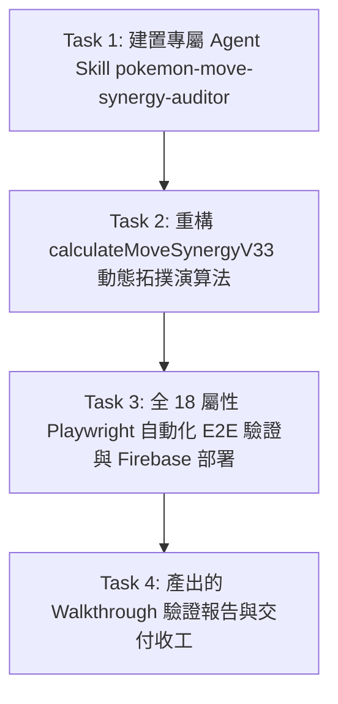

# [新對話交接計畫] 全 18 屬性招式連攜拓撲重構與 Agent Skill 建置

本計畫用於在新對話中無縫續接工作。本階段目標為：徹底修復「多對一重複映射 (M-to-1 Overlaps)」與「無連攜孤兒招式 (Orphan Moves)」，建置專屬 Agent Skill `pokemon-move-synergy-auditor`，完成全 18 屬性 Playwright 自動化驗證與 Firebase Hosting 上線部署。

---

## 🎯 新對話執行工作順序與 Task 規劃 (Execution Sequence)



---

## 📋 任務詳細規格 (Task Specifications)

### Task 1: 建置專屬 Agent Skill `pokemon-move-synergy-auditor`
- **目標**：創建一個專門用於「寶可夢招式技能樹全 18 屬性連攜圖譜稽核與自動化校驗」的 Agent Skill。
- **目錄架構**：
  - `skills/pokemon-move-synergy-auditor/SKILL.md`：定義技能說明、Trigger 情境、18 屬性稽核規範與演算法重構指南。
  - `skills/pokemon-move-synergy-auditor/scripts/audit-synergy-graph.js`：Playwright 全屬性一鍵自動稽核腳本。

### Task 2: 重構 `calculateMoveSynergyV33` 邏輯 (動態拓撲演算法)
- **目標**：替換 `kpi-dashboard.html` / `pokemon-skill-tree.js` 中硬編碼的 Regex 比對，改採動態拓撲對映引擎。
- **核心演算法設計**：
  1. **一對一獨占映射 (1-to-1 Exclusive Mapping)**：
     - 同一 T1 招式導向特定且獨佔的 T2 招式連攜（例如 `叫聲` 導向 `弱點壓制/叫聲連攜`；`甩尾` 導向 `破防連攜/甩尾連攜`）。
  2. **Gen 2~9 程序化招式自動適配 (Procedural Synergy Fallback)**：
     - 若為程序化生成招式（如 `鋼鐵突襲_T2_2`），動態依據其前置 T1 招式之軌道 (`ATK`/`SPA`/`BUF`/`DIS`/`ULT`) 與屬性生成專屬連攜 Badge，消除 465 個孤兒招式。

### Task 3: 進行全 18 屬性 Playwright 自動化驗證與 Firebase 部署
- **測試驗證**：
  - 執行 `audit-synergy-graph.js`，確認全 18 屬性掃描結果為：
    - 多對一重複映射 (M-to-1 Overlaps): **0 處 (PASS)**
    - 無連攜孤兒 T2 招式 (Orphan T2 Moves): **0 個 (PASS)**
- **構建與部署**：
  - 同步靜態檔：`powershell -ExecutionPolicy Bypass -File sync-public.ps1`
  - Git Commit & Push：提交至 `master` 分支。
  - Firebase Hosting 發布：`npx firebase-tools deploy --only hosting`

### Task 4: 產出 Walkthrough 驗證報告與交付收工
- 撰寫完整 `walkthrough.md` 報告與實測結果截圖數據，回報老師收工。

---

## 🔍 新對話輕量化分階段啟動提示詞 (Optimized Progressive Handoff Prompt)

在新對話開啟時，請直接複製以下【輕量化開工提示詞】給 AI：

```text
請協助續接《全 18 屬性招式連攜拓撲重構與 Agent Skill 建置》工作：
1. 請讀取交接檔：g:/我的云端硬盘/teacher-toolkit/docs/implementation_plan_move_synergy.md
2. 當前步驟：請【僅執行 Task 1】建置專屬 Agent Skill `pokemon-move-synergy-auditor`。
3. Task 1 完成後請回報進度並停下，等待下一步指示。請勿一次執行所有 Task。
```

