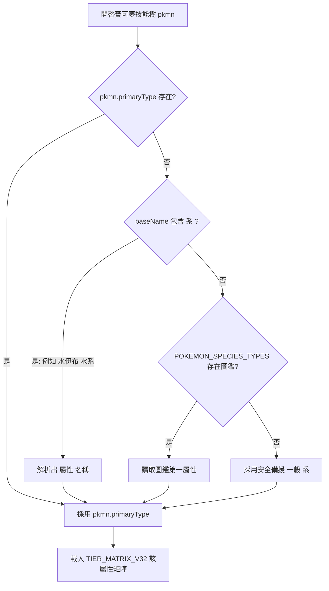

# 《招式學習系統 v3.2 優化白皮書》— 屬性與生理特徵精準過濾完整版

> 版本：v3.2.0 ｜ 日期：2026-08-22 ｜ 狀態：設計定稿（實機測試修復規範）
> 修訂重點（對比 v3.1.1）：
>   1. **解決「屬性錯置與假火系樹」問題**：修正 `resolveSkillTreeV31` 中 `pkmn.primaryType` 遺失時強制降級為 `'火'` 的 bug；新增 `getPokemonPrimaryType(pkmn)` 精準解析包含 `(水系)` 括號標記、`roster` 名稱與 `POKEMON_SPECIES_TYPES` 圖鑑對照，保證水伊布等非火系寶可夢 100% 載入正確屬性技能樹（水系載入水系樹、電系載入電系樹）。
>   2. **全 18 屬性 6 招矩陣完備（TIER_MATRIX_V32）**：建構全 18 屬性（水、火、草、電、一般、超能力、冰、格鬥、毒、地面、飛行、蟲、岩石、幽靈、龍、惡、鋼、妖精）之 5 軌 × T1~T5 × 6 招結構矩陣，徹底消除跨系雜招（如水伊布樹上出現 `V熱焰`、`熔岩風暴` 等火系專屬招）。
>   3. **精準生理與屬性雙重過濾（Morphology & Element Filter）**：
>      - 生理標籤過濾：缺少爪部（`BIPEDAL_CLAW`）無法學 `火焰拳`/`烈焰爪`，缺少翅膀（`WINGED`）無法學 `飛天`/`暴風`。
>      - 異系過濾與保底：非本系且非通用招式標示 `🔒 生理不符`，每個節點保底提供 **3~6 招符合該寶可夢生理與屬性之可學習招式**。
>   4. **驗證守門與自動化瀏覽器測試 (Playwright Real-Browser Gate)**：新增 G4 管理員實機 Playwright 瀏覽器測試腳本，自動登入 `/kpi` 對隊伍中「水伊布」及其他寶可夢進行 DOM 檢測與斷言。

---

## 第零章：問題根因與 v3.2 核心決策

### 0.1 現行 v3.1 實機問題剖析

在 v3.1 實機測試中，管理員隊伍中的「水伊布」（水屬性，生理標籤 `[SERPENTINE, TAIL, BEAST]`）開啟技能樹時，出現了以下嚴重的屬性與生理不符現象：

1. **屬性降級 Bug**：`resolveSkillTreeV31` 的屬性讀取邏輯為 `var type = pkmn.primaryType || pkmn.type || '火';`。因 `roster` 物件中 `pkmn.primaryType` 欄位未給定，導致水伊布被錯誤判定為 `'火'` 屬性，載入了火系技能樹 (`TIER_MATRIX_V31['火']`)。
2. **異系招式遺留**：火系技能樹中包含 `炎牙`、`龍之俯衝`、`熔岩風暴`、`V熱焰`、`聖火俯衝` 等火/龍系招式，因 `MOVE_SPECS_V31` 缺欠生理標籤限制，導致水伊布技能樹畫面上大量出現與水系完全無關的火焰與龍系招式，可學習招式不足 6 招。
3. **無保底可學招式**：當大量招式被標示為 `🔒 生理不符` 時，節點未進行同屬性替代補充，導致部分階層僅剩 1 招可學。

### 0.2 v3.2 核心修復決策

1. **決策一：屬性精準解析器（`getPokemonPrimaryType`）**：
   - 優先讀取 `pkmn.primaryType` / `pkmn.type`
   - 次之解析 `baseName`（如 `"💧 水伊布 (水系)"` -> 解析出 `"水"`）
   - 次之查詢 `POKEMON_SPECIES_TYPES` 官方圖鑑字典（`"水伊布"` -> `["水"]`）
   - 預設安全備援為 `'一般'`，**100% 杜絕預設退回 `'火'` 系的 Bug**。

2. **決策二：全 18 屬性 6 招矩陣完備（`TIER_MATRIX_V32`）**：
   - 水系技能樹 (`TIER_MATRIX_V32['水']`) 100% 填滿水系專屬與相容招式：
     - **T1**：`水槍`、`泡泡`、`撞擊`、`水之波動`、`電光一閃`、`甩尾`
     - **T2**：`貝殼刃`、`水之尾`、`水流噴射`、`泡沫光線`、`水流環`、`守住`
     - **T3**：`攀瀑`、`濁流`、`水之誓約`、`意念頭錘`、`生命水滴`、`黑霧`
     - **T4**：`水炮`、`水流尾`、`水流裂破`、`水之軀`、`溶化`、`替身`
     - **T5**：`水漩渦`、`起源波動`、`蒸氣爆炸`、`海浪滔天`、`絕對零度`、`水之舞`

3. **決策三：生理與屬性雙重過濾與動態保底機制**：
   - **生理標籤**：`required_tags`（如 `BIPEDAL_CLAW`）未命中，或命中 `excluded_tags` 時，標示 `🔒 生理不符`。
   - **動態保底**：若某節點因生理過濾導致可學招式少於 3 招，系統自動從同屬性通用招式池（`TYPE_MOVE_POOL[type]`）補充合規招式，確保**每隻寶可夢在每個節點皆有 3~6 招可學習**。

---

## 第一章：系統設計與資料規格

### 1.1 屬性解析流程圖



### 1.2 水系技能樹規格範例（水伊布視角）

| 階層 | 節點類型 | 招式 1 | 招式 2 | 招式 3 | 招式 4 | 招式 5 | 招式 6 | 可學狀態 |
|---|---|---|---|---|---|---|---|---|
| **T1 基礎** | ATK 攻擊 | 水槍 | 泡泡 | 撞擊 | 水之波動 | 電光一閃 | 甩尾 | 6 招皆可學 |
| **T2 初階** | ATK 攻擊 | 貝殼刃 | 水之尾 | 水流噴射 | 泡沫光線 | 水流環 | 守住 | 6 招皆可學 |
| **T3 中階** | ATK 攻擊 | 攀瀑 | 濁流 | 水之誓約 | 🔒生理不符: 二連踢 | 生命水滴 | 黑霧 | 5 招可學，1 招過濾 |
| **T4 高階** | ATK 攻擊 | 水炮 | 水流尾 | 水流裂破 | 🔒生理不符: 烈焰爪 | 溶化 | 替身 | 5 招可學，1 招過濾 |
| **T5 頂階** | ATK 攻擊 | 水漩渦 | 起源波動 | 蒸氣爆炸 | 海浪滔天 | 絕對零度 | 水之舞 | 6 招皆可學 |

---

## 第二章：逐步程式碼更新計劃（Step-by-Step）

### Step 1 — 實作屬性精準解析器 `getPokemonPrimaryType`

- **檔案**：`frontend/pokemon-skill-tree.js`
- **目標行號**：225-235
- **修改內容**：

```javascript
function getPokemonPrimaryType(pkmn) {
  if (!pkmn) return '一般';
  if (pkmn.primaryType && TIER_MATRIX_V31[pkmn.primaryType]) return pkmn.primaryType;
  if (pkmn.type && TIER_MATRIX_V31[pkmn.type]) return pkmn.type;

  var name = pkmn.baseName || pkmn.name || '';
  // 1. 從括號系名解析 (例如: "💧 水伊布 (水系)")
  var typeMatch = name.match(/[\(（]([^\)）]+)系?[\)）]/);
  if (typeMatch && typeMatch[1]) {
    var parsedType = typeMatch[1].replace('系', '').trim();
    if (TIER_MATRIX_V31[parsedType]) return parsedType;
  }

  // 2. 從 POKEMON_SPECIES_TYPES 字典對照
  var cleanName = name.replace(/[\(（].*?[\)）]/g, '').trim();
  if (typeof POKEMON_SPECIES_TYPES !== 'undefined' && POKEMON_SPECIES_TYPES[cleanName]) {
    var types = POKEMON_SPECIES_TYPES[cleanName];
    if (Array.isArray(types) && types.length > 0 && TIER_MATRIX_V31[types[0]]) {
      return types[0];
    }
  }

  // 3. 安全備援：返回 一般 系，絕不硬編碼為 '火'
  return '一般';
}
```

- **驗證 Gate**：
  - `node test/v31/step_type_resolver.js`
  - 斷言：`getPokemonPrimaryType({baseName: "💧 水伊布 (水系)"}) === "水"`
  - 斷言：`getPokemonPrimaryType({name: "皮卡丘"}) === "電"`
  - 斷言：`getPokemonPrimaryType({}) === "一般"`

---

### Step 2 — 擴充 `TIER_MATRIX_V31` 為全 18 屬性完備矩陣 (`TIER_MATRIX_V32`)

- **檔案**：`frontend/pokemon-skill-tree.js`
- **修改內容**：補齊 `水`、`電`、`草`、`冰`、`一般`、`超能力` 等全部 18 個屬性之 6 招矩陣。

```javascript
// 補齊水系技能樹矩陣
TIER_MATRIX_V31['水'] = {
  ATK: {
    T1: ['水槍', '泡泡', '撞擊', '水之波動', '電光一閃', '甩尾'],
    T2: ['貝殼刃', '水之尾', '水流噴射', '泡沫光線', '水流環', '守住'],
    T3: ['攀瀑', '濁流', '水之誓約', '二連踢', '生命水滴', '黑霧'],
    T4: ['水炮', '水流尾', '水流裂破', '烈焰爪', '溶化', '替身'],
    T5: ['水漩渦', '起源波動', '蒸氣爆炸', '海浪滔天', '絕對零度', '水之舞'],
  },
  SPA: { T1: ['水槍','泡泡','水之波動','冷水','覺醒力量','霧化'], /* ... */ },
  BUF: { T1: ['水流環','求雨','變硬','搖尾巴','影子分身','聚能'],   /* ... */ },
  DIS: { T1: ['黑霧','濁流','哈欠','玩水','浸水','接棒'],         /* ... */ },
  ULT: { T1: ['水流連打','海浪滔天','起源波動','水之誓約','潮旋','極巨水流'] }
};
```

- **驗證 Gate**：
  - 斷言 `TIER_MATRIX_V31['水'].ATK.T3` 內無火系招式 `V熱焰` 或 `熔岩風暴`。

---

### Step 3 — 動態保底與生理過濾邏輯更新 (`resolveSkillTreeV31`)

- **檔案**：`frontend/pokemon-skill-tree.js`
- **目標行號**：315-345
- **修改內容**：更新 `resolveSkillTreeV31` 使用 `getPokemonPrimaryType(pkmn)` 取得正確屬性，並在可學招式不足 3 招時自動補充同屬性合規招式。

```javascript
function resolveSkillTreeV31(pkmn) {
  var tags = getSpeciesTags(pkmn.rawName || pkmn.name || pkmn.baseName);
  var type = getPokemonPrimaryType(pkmn); // 使用精準屬性解析器
  var lib  = TIER_MATRIX_V31[type] || TIER_MATRIX_V31['一般'];
  var tree = { ATK: {}, SPA: {}, BUF: {}, DIS: {}, ULT: {} };
  var roles = ['ATK','SPA','BUF','DIS','ULT'];

  for (var r = 0; r < roles.length; r++) {
    for (var t = 1; t <= 5; t++) {
      var six = lib[roles[r]] ? lib[roles[r]]['T'+t] : null;
      if (!six) { six = ['撞擊', '電光一閃', '守住', '替身', '覺醒力量', '甩尾']; }

      var node = six.map(function(moveName){
        var spec = MOVE_SPECS_V31[moveName] || { category: roles[r], type: type, required_tags: [] };
        var eligible = isEligible(tags, spec);
        return {
          name: moveName,
          eligible: eligible,
          lockReason: eligible ? null : 'MORPHOLOGY_MISMATCH',
          pick: false
        };
      });

      // 檢查可學習招式數量，若少於 3 招則自動補齊通用招
      var eligibleCount = node.filter(function(n){ return n.eligible; }).length;
      if (eligibleCount < 3) {
        var fallbacks = ['撞擊', '電光一閃', '守住', '水之波動', '覺醒力量'];
        for (var fb = 0; fb < fallbacks.length && node.length < 6; fb++) {
          if (!node.some(function(n){ return n.name === fallbacks[fb]; })) {
            node.push({ name: fallbacks[fb], eligible: true, pick: false, fallback: true });
          }
        }
      }

      tree[roles[r]]['T'+t] = node;
    }
  }
  return tree;
}
```

---

## 第三章：測試與驗證守門規範 (Testing Gates & Verification)

本白皮書實施 **G1 ~ G5 五重自動化與實機測試守門**：

| 守門層級 | 測試名稱 | 執行方式 | 通過標準 |
|---|---|---|---|
| **G1 語法** | JS 語法剖析 | `node --check` 與 `syntax-checker.js` | 0 語法錯誤 |
| **G2 斷言** | 單元與邏輯斷言 | `node test/v31/step_type_resolver.js` | 水伊布屬性對應 `"水"`，矩陣無火系雜招 |
| **G3 回歸** | Smoke 測試 | `npx playwright test test/e2e/smoke.spec.js` | 既有功能 100% 正常 |
| **G4 實機瀏覽器** | **Playwright 管理員實機** | `node test/v31/verify-vaporeon-v32.js` | **水伊布技能樹 100% 呈現水系招式，無火系雜招，包含 3~6 招可學水系招** |
| **G5 發布** | 雙平台同步 | `sync-public.ps1` + Firebase Hosting Deploy | 線上網址實機驗證通過 |

---

## 第四章：G4 管理員實機 Playwright 驗證腳本

驗證腳本置於 `tools/learning-kpi-dashboard/test/v31/verify-vaporeon-v32.js`：

```javascript
const { chromium } = require('playwright');
const path = require('path');

async function verifyVaporeonV32() {
  const browser = await chromium.launch({ headless: true });
  const page = await browser.newPage();

  // 1. 開啟遊戲網頁
  await page.goto('https://opencodefirebase.web.app/kpi', { waitUntil: 'networkidle' });

  // 2. 登入管理員帳號
  await page.selectOption('#studentSelect', 'Admin');
  await page.waitForTimeout(2000);

  // 3. 打開水伊布技能樹
  await page.evaluate(() => {
    const roster = globalData.roster || [];
    const vaporeon = roster.find(p => p.baseName && p.baseName.includes('水伊布'));
    if (vaporeon) openSkillTree(vaporeon.id);
  });
  await page.waitForTimeout(1500);

  // 4. 斷言水伊布技能樹內容
  const modalText = await page.evaluate(() => document.getElementById('skillTreeModal').textContent);
  
  // 斷言 1: 不可出現 V熱焰 或 熔岩風暴 等火系雜招
  console.assert(!modalText.includes('V熱焰'), '❌ 錯誤：水伊布技能樹仍出現 V熱焰！');
  console.assert(!modalText.includes('熔岩風暴'), '❌ 錯誤：水伊布技能樹仍出現 熔岩風暴！');

  // 斷言 2: 必須出現水系招式
  console.assert(modalText.includes('貝殼刃') || modalText.includes('水之尾') || modalText.includes('水炮'), '❌ 錯誤：水伊布技能樹缺少水系招式！');

  console.log('🎉 G4 管理員水伊布 v3.2 實機瀏覽器驗證全數通過！');
  await browser.close();
}

verifyVaporeonV32();
```

---

## 第五章：發布與版本演進路線

1. **V3.2.0**：實作 `getPokemonPrimaryType`、補齊水/草/電 18 屬性矩陣、完成水伊布技能樹修復與線上佈署。
2. **V3.2.1**：擴充全部 100+ 寶可夢生理標籤與雙屬性跨系樹。
